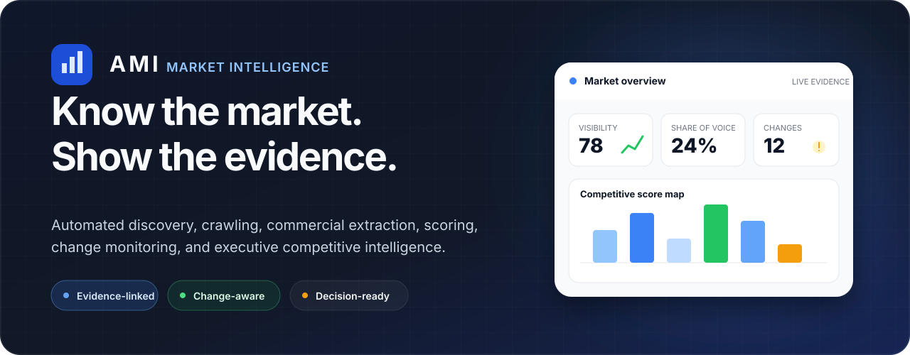
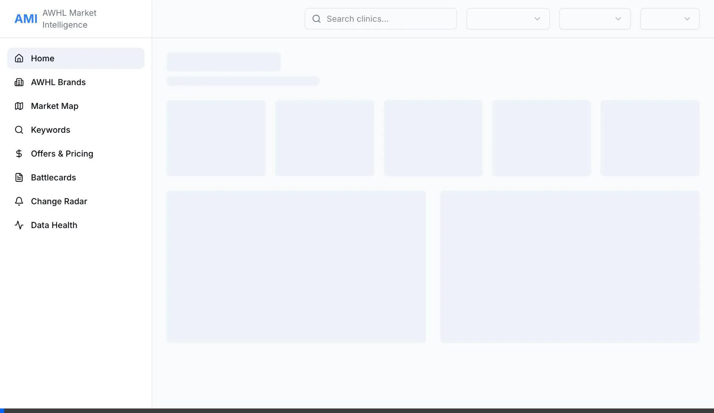

<p align="center">
  
</p>

<p align="center">
  <a href="#dashboard-tour"><strong>Dashboard tour</strong></a>
  &nbsp;&nbsp;·&nbsp;&nbsp;
  <a href="#intelligence-pipeline"><strong>Pipeline</strong></a>
  &nbsp;&nbsp;·&nbsp;&nbsp;
  <a href="#data-and-evidence-model"><strong>Data model</strong></a>
  &nbsp;&nbsp;·&nbsp;&nbsp;
  <a href="#run-the-system"><strong>Run locally</strong></a>
  &nbsp;&nbsp;·&nbsp;&nbsp;
  <a href="docs/ami-master-plan.md"><strong>Master plan</strong></a>
</p>

<p align="center">
  
  
  
  
</p>

<p align="center">
  <strong>Turn a moving market into structured, source-backed decisions.</strong><br />
  AMI automatically discovers competitors, crawls their digital footprint, extracts commercial and SEO signals, scores market position, monitors change, and surfaces the evidence through an executive intelligence dashboard.
</p>

> [!NOTE]
> AMI is a substantial internal product and data-pipeline prototype built for AWHL's Singapore wellness market. The repository contains the dashboard, database schema, workflow exports, crawl service, tests, and operating documentation. Hosted production deployment and some automated alerting remain roadmap work.

## Recruiter quick scan

| | |
| --- | --- |
| **What I built** | An evidence-first competitive intelligence system spanning search discovery, site crawling, data extraction, normalization, scoring, monitoring, and executive decision surfaces. |
| **My role** | Product design, data architecture, workflow design, SQL schema, crawling strategy, scoring model, dashboard engineering, testing, and deployment planning. |
| **Core challenge** | Convert noisy, changing public web data into comparable market facts while preserving provenance, freshness, and an auditable path back to source evidence. |
| **Primary outputs** | Market overview, competitor map, battlecards, offers and pricing, keyword/SERP analysis, change radar, opportunities, threats, and data-health monitoring. |
| **Stack** | Next.js 16, React 19, TypeScript, PostgreSQL, n8n, Python crawl service, Recharts, SQL migrations and assertions. |
| **Engineering posture** | Idempotent workflow stages, normalized entities, crawl-policy controls, source-linked evidence, explicit data health, and reproducible scoring. |

## Dashboard tour

<p align="center">
  
</p>

| Surface | Decision it supports |
| --- | --- |
| **Home** | Understand visibility, share of voice, recent threats, and immediate opportunities in roughly one minute. |
| **Market Map** | Compare and filter the full competitor set, then open a source-backed deep dive. |
| **Battlecards** | Review one competitor's scores, offers, calls to action, positioning, and supporting evidence. |
| **Offers & Pricing** | Compare price distributions, trial mechanics, discounting, and conversion tactics. |
| **Keywords & SERP** | See where the organization wins or loses search visibility and which queries reveal new competitors. |
| **Change Radar** | Review meaningful market changes since the previous observation window. |
| **Data Health** | Inspect pipeline freshness, crawl coverage, extraction state, and broken or incomplete records. |

AMI is designed to answer “what changed, why does it matter, and what evidence supports that conclusion?” rather than producing a static list of competitors.

## Intelligence pipeline

```text
Verticals + services + locations
              │
              ▼
1. Build search queries
              │
              ▼
2. Capture SERP snapshots and discover domains
              │
              ▼
3. Resolve robots.txt, sitemaps, and page inventory
              │
              ▼
4. Route bounded depth and breadth crawls
              │
              ▼
5. Extract SEO, keyword, page-type, and content signals
              │
              ▼
6. Extract commercial facts: pricing, offers, CTAs, services
              │
              ▼
7. Normalize and score competitors across comparable dimensions
              │
              ▼
8. Monitor changes, expand discovery, and update dashboard projections
```

The repository contains **13 n8n workflow exports** implementing the eight-stage program, including separate deep-sitemap, depth-crawl, breadth-first, SEO, keyword, and clinic-rollup lanes.

### Stage boundaries

Each stage has a narrow responsibility:

- discovery records how a domain entered the system;
- page inventory separates known URLs from crawl attempts;
- crawl storage retains response and content state;
- extraction creates typed facts rather than dashboard-ready prose;
- normalization reconciles entities and comparable units;
- scoring derives explainable dimensions from stored facts;
- monitoring compares observations over time;
- dashboard queries project decisions without becoming the source of truth.

## Data and evidence model

The PostgreSQL model is organized around durable entities and observations:

- verticals, services, locations, clinics, and domains;
- SERP queries, snapshots, ranks, and discovered competitors;
- sitemap and page inventories;
- crawl attempts, page content, and page classification;
- SEO and keyword observations;
- commercial facts such as price, offer, service, and CTA evidence;
- score dimensions and aggregate competitor scores;
- workflow runs, data-health state, and monitoring events.

Every insight should retain enough provenance to answer:

1. Which source page or search result produced this fact?
2. When was it observed?
3. Which extraction or normalization path transformed it?
4. Which inputs contributed to the score?
5. Is the source still fresh and reachable?

Read [`docs/data_strategy.md`](docs/data_strategy.md), [`docs/ami-db-analysis.md`](docs/ami-db-analysis.md), and [`ami_schema_v1.0.sql`](ami_schema_v1.0.sql).

## Scoring and decision surfaces

AMI models competitor position across five dimensions rather than collapsing the market into one opaque rank. The scoring layer is designed to be:

- reproducible from stored observations;
- comparable across competitors and time windows;
- decomposable into dimension-level explanations;
- explicit about missing or stale data;
- linked back to the evidence that drove each component.

The dashboard consumes these projections to surface:

- visibility leaders and laggards;
- share-of-voice gaps;
- pricing and offer outliers;
- conversion-pattern differences;
- new entrants and material site changes;
- threats requiring review;
- opportunities with source evidence.

## Crawl and reliability boundaries

Public-web intelligence fails quickly when crawling is treated as a single HTTP request. AMI includes dedicated controls for:

- robots.txt resolution and policy-aware routing;
- sitemap indexes and nested sitemap discovery;
- bounded depth and breadth-first crawl strategies;
- domain validation and canonical identity;
- duplicate-page and repeated-run handling;
- response, content, and extraction status separation;
- retryable versus terminal failure;
- explicit freshness and data-health reporting.

The Python robots service and its tests live under [`services/robots/`](services/robots/). Discovery and scoring assertions live under [`tests/sql/`](tests/sql/).

## What this project demonstrates

- **Applied data engineering:** multi-stage ingestion, normalized schemas, provenance, freshness, and idempotent workflow design.
- **Applied AI extraction:** converting unstructured pages into typed commercial and SEO facts with validation boundaries.
- **Search intelligence:** query generation, SERP observation, competitor discovery, rank and keyword analysis.
- **Product analytics:** turning raw observations into explainable scores and decision-ready projections.
- **Full-stack product engineering:** Next.js dashboard, API routes, typed query layer, charts, filters, evidence drawers, and operational health surfaces.
- **Workflow engineering:** n8n orchestration, stage contracts, crawl routing, monitoring, and expansion loops.

## Repository map

```text
ami-awhl/
├── dashboard/              # Next.js intelligence dashboard and query layer
├── n8n/workflows/          # 13 workflow exports across W-1 through W-8
├── sql/migrations/         # Incremental PostgreSQL schema
├── sql/seeds/              # Verticals, services, locations, and templates
├── services/robots/        # Python robots.txt resolution service
├── tests/sql/              # Schema, discovery, scoring, and monitor assertions
├── docs/                   # Data, pipeline, deployment, UX, and runbook docs
└── ami_schema_v1.0.sql     # Consolidated schema reference
```

## Run the system

AMI is a multi-service system rather than a single-command demo. The dashboard can be started independently; the full intelligence loop also requires PostgreSQL and n8n.

### Dashboard

```bash
git clone https://github.com/joyboy257/ami-awhl.git
cd ami-awhl/dashboard
npm install
npm run dev
```

Configure the PostgreSQL connection expected by [`dashboard/lib/db.ts`](dashboard/lib/db.ts), then open `http://localhost:3000`.

### Database

Apply migrations in numerical order to a development PostgreSQL database, then load the relevant seed files:

```bash
psql "$DATABASE_URL" -f sql/migrations/001_core_entities.sql
# Continue through the remaining ordered migrations.
psql "$DATABASE_URL" -f sql/seeds/seed_verticals.sql
psql "$DATABASE_URL" -f sql/seeds/seed_services.sql
psql "$DATABASE_URL" -f sql/seeds/seed_geo_sets.sql
```

Use [`docs/runbook.md`](docs/runbook.md) and [`docs/environment_summary.md`](docs/environment_summary.md) for the environment-specific path rather than applying production assumptions to a local database.

### Workflows

Import the workflow exports under [`n8n/workflows/`](n8n/workflows/) into a development n8n instance and configure credentials without committing secret values. The workflow guide is [`n8n/README.md`](n8n/README.md).

## Verification

```bash
# Dashboard static checks and production build
cd dashboard
npm run lint
npm run build

# Robots service tests
cd ../services/robots
python -m pytest

# Discovery smoke path
cd ../..
bash scripts/test-discovery.sh
```

SQL assertions for schema, discovery, scoring, and monitoring are stored under [`tests/sql/`](tests/sql/).

## Current status

| Area | Status |
| --- | --- |
| PostgreSQL schema and migrations | **Present** |
| Eight-stage workflow program | **Present as 13 exported n8n workflows** |
| Crawl-policy microservice | **Implemented with tests** |
| Dashboard and decision surfaces | **Implemented** |
| Evidence and data-health model | **Implemented in schema and UI foundations** |
| Hosted Vercel/Supabase production deployment | **Proposed / not claimed as completed here** |
| Automated external alerts | **Roadmap** |
| Regional expansion and predictive analysis | **Roadmap** |

The repository should be evaluated as a working intelligence product and pipeline foundation, not as a claim that every workflow is currently operating against a live production market dataset.

## Documentation map

| Topic | Start here |
| --- | --- |
| Product and system plan | [`docs/ami-master-plan.md`](docs/ami-master-plan.md) |
| Data strategy | [`docs/data_strategy.md`](docs/data_strategy.md) |
| Pipeline strategy | [`docs/pipeline_strategy.md`](docs/pipeline_strategy.md) |
| Workflow overview | [`docs/workflow_overview.md`](docs/workflow_overview.md) |
| Database analysis | [`docs/ami-db-analysis.md`](docs/ami-db-analysis.md) |
| Dashboard UX audit | [`docs/dashboard-ux-audit.md`](docs/dashboard-ux-audit.md) |
| Deployment proposal | [`docs/deployment-proposal.md`](docs/deployment-proposal.md) |
| Operations runbook | [`docs/runbook.md`](docs/runbook.md) |

## Origin

AMI was built to replace manual competitor spreadsheets and episodic website checks with a repeatable, evidence-backed market observation system.

The key product decision is that every useful competitive conclusion should remain connected to the public evidence and processing history that produced it.
