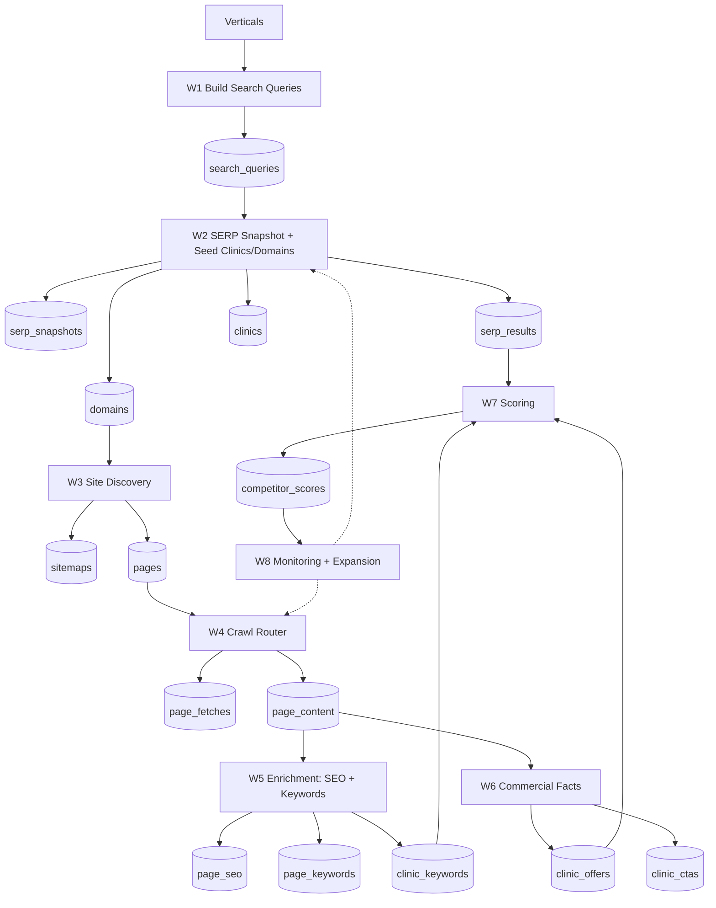

# AMI Pipeline Strategy (n8n) — Polished v1.1

**AMI (AWHL Market Intelligence)** is an automated competitive intelligence pipeline for the Singapore wellness market.

**Verticals (v1):** TCM • Beauty • Chiropractic • Aesthetics  
**North-star UX:** *Click “Run” → AMI populates Postgres with battlecard-ready competitor intel (SEO + positioning + conversion signals + pricing evidence), bounded and observable.*

---

## 1) Mental Model

AMI runs an always-on loop:

**Vertical → Search Queries → SERP → Clinics/Domains → Site Inventory → Crawl → Enrich (SEO + Keywords + Commercial Facts) → Score → Monitor → Repeat**

System-wide invariants:

- **Bounded:** explicit budgets so runs never explode.
- **Retryable:** safe to re-run; job-style execution; no silent failures.
- **Observable:** every step emits counts + failure reasons.
- **Incremental:** reprocess only when content changes (hash-based).

---

## 2) Battlecard-Ready Data Spec

If W4/W5 only extract `title` and link counts, the output feels “pitiful” because it can’t answer business questions. The point of AMI is **positioning + conversion + pricing intelligence**.

### 2.1 Page-level SEO (deterministic, parsed from `html_body`)

**Core SEO**
- `title`
- `meta_description`
- `h1`
- `canonical_url` from `<link rel="canonical" href="...">`
- `robots_meta` from `<meta name="robots" content="...">` (derive `noindex`/`nofollow` flags)
- Heading structure: `h1_count`, `h2_count`, `h3_count`, plus `top_h2_list` (first ~10)
- Link counts: `internal_links_count`, `external_links_count` (host-based)
- OpenGraph/Twitter tags as JSON (`og:*`, `twitter:*`)

**Structured data (schema.org)**
- `schema_types[]` extracted from JSON-LD blocks:
  - Handle arrays, `@graph`, and `@type` as string or array
  - De-duplicate, cap to reasonable size

**Technical / internationalization**
- `hreflang_locales[]` (if any)
- Optional quick health signals: `title_length`, `meta_description_length`

### 2.2 Conversion signals (deterministic, battlecard gold)

Store these as structured keys inside `page_seo.og_data` (or equivalent JSONB) to avoid schema sprawl.

- `has_whatsapp` (wa.me / api.whatsapp.com)
- `has_tel` (tel:)
- `has_mailto` (mailto:)
- `has_form` (`<form>` present)
- `booking_provider` (fresha/mindbody/calendly/acuity/etc. if detectable)
- `chat_widget` (intercom/drift/crisp/tawk/zendesk/etc. patterns)
- `pricing_detected` (simple price/SGD/$ patterns)
- `faq_detected` (FAQ markup/patterns)
- `testimonials_detected` (testimonial/review patterns)
- `inferred_page_type` (service / pricing / contact / blog / other)

### 2.3 Clinic-level rollups (battlecard summary)

- Top clinic keywords (weighted toward service/pricing/contact pages)
- Conversion channel mix (WhatsApp vs booking vs phone)
- Schema adoption (does the clinic use `LocalBusiness` / `MedicalBusiness` etc.)
- Evidence-backed offers & CTAs (from W6)

---

## 3) Data Model (Minimum Viable Tables)

Keep tables “source-of-truth-ish”. Extend later.

### 3.1 Core
- `verticals`, `services`, `geo_sets`
- `search_query_templates`, `search_queries`

### 3.2 SERP
- `serp_snapshots` (raw JSON)
- `serp_results` (parsed ranks)
- `domains` (competitor sites)
- `clinics` (canonical entity; may be provisional)

### 3.3 Inventory + Crawl
- `sitemaps`, `pages`
- `page_fetches` (append-only logs)
- `page_content` (html_body + cleaned markdown + word_count)

### 3.4 Enrichment
- `page_seo` (deterministic SEO + conversion signals; rich extras in JSONB)
- `page_keywords`, `clinic_keywords`
- `clinic_offers`, `clinic_ctas` (evidence-first)

### 3.5 Ops (required for “smooth runs”)
- `runs`, `jobs`

---
## 4) Workflow Strategy (W1 → W8)

### W1 — Build Search Queries
**Goal:** generate deterministic, repeatable top-of-funnel queries to discover competitors and market demand.  
**Cadence:** weekly or on demand.

**Inputs:** `services × geo_sets × templates` (bounded), plus intent terms (`price`, `trial`, `package`, `promo`, `review`, `best`).

**Outputs:** `search_queries` with tiers A/B/C and `active=true`.

**Budgets (defaults)**
- Max queries per vertical per run: **200**
- Always enforce uniqueness per `(vertical_id, query_text)`

---

### W2 — SERP Snapshot + Seed Clinics/Domains
**Goal:** discover competitors and visibility signals.  
**Cadence:** daily (Tier A), weekly (Tier B).

**Steps**
1. Snapshot SERP response → store raw JSON in `serp_snapshots`.
2. Parse results → `serp_results` (organic + local pack if present).
3. Upsert `domains` and resolve `clinics`.

**Important (Singapore reality)**
- **Do not depend on Local Pack**. Many SG queries return organic-only.
- If local pack is absent, create **provisional clinics** from domains (confidence flag), then optionally enrich later.

**Budgets (defaults)**
- Max SERP calls per run: **150 (smoke)** / **300 (full)**
- Max new domains per run: **50** (queue the rest)

---

### W3 — Site Discovery (Inventory Build)
**Goal:** turn competitor domains into a URL inventory cheaply and safely.  
**Cadence:** daily for new domains; monthly refresh.

**Steps**
- Fetch `robots.txt` and parse sitemap directives
- Guess common sitemap endpoints (bounded)
- Parse sitemap XML with recursion depth ≤ **3**
- Upsert `pages` with `lastmod` where available

**Output:** a large inventory of candidate pages, without doing heavy crawling yet.

---

### W4 — Crawl Router (Breadth-first, high-intent first)
**Goal:** fetch real pages reliably, store stable content, and provide a clean foundation for all downstream extraction.

**Selection strategy (critical)**
- **Breadth-first across domains** (avoid crawling 200 pages from only 3 domains).
- Prioritize high-intent URLs first:
  `/pricing|price|trial|promo|package|services|treatments|contact|book`
- Exclude sitemap-like URLs:
  - URL pattern filter (e.g., `%sitemap%`, `sitemap(_index)?\.xml$`)
  - Body detection (`<urlset>` / `<sitemapindex>`)

**Quality gates (must log reason codes)**
- Blocked/captcha patterns
- HTML too small / clearly error page
- Sitemap XML detected

**Writes**
- `page_fetches` (every attempt, success + fail)
- `page_content` (html_body + cleaned markdown + word_count)
- `pages.content_hash` = **SHA256(normalized markdown)**

**Budgets (defaults)**
- Per-domain concurrency: **1**
- Delay between requests: **~2s**
- Pages per run: start **20–100**, only increase after coverage improves

---

### W5 — Enrichment: SEO + Keywords
**Goal:** produce battlecard-ready SEO + positioning signals.

**W5A (Deterministic SEO + conversion signals)**
- Parse from `page_content.html_body` (true metadata)
- Store core SEO fields + `schema_types[]`
- Store rich extras into JSONB (e.g., conversion signals, headings counts)

**W5B (Keyword extraction)**
- Only run on **real pages** with meaningful markdown
- Tiered extraction:
  - Cheap: tf-idf / n-grams
  - Optional AI: only for priority page types

**W5C (Clinic rollup)**
- Aggregate `page_keywords` → `clinic_keywords`
- Weight page types (service/pricing/contact > blog)
- Keep top N per clinic

---

### W6 — Commercial Facts (Evidence-first)
**Goal:** extract offers, prices, promos, and CTAs with proof.

- AI extraction only on likely commercial pages
- Every extracted row must include an evidence snippet that substring-matches page content
- Write to `clinic_offers` and `clinic_ctas`

---

### W7 — Scoring
**Goal:** turn raw signals into ranked competitor insights.

Inputs typically include:
- SERP visibility (rank-weighted)
- Inventory depth (pages discovered + crawled)
- Conversion strength (WhatsApp/booking/phone)
- Commercial completeness (offers present)
- Technical signals (schema usage, indexation)

Outputs:
- per-vertical leaderboards
- competitor battlecards

---

### W8 — Monitoring + Expansion
**Goal:** keep the dataset fresh and discover new competitors.

Cadence:
- Daily: Tier A SERPs + crawl due pages
- Weekly: Tier B SERPs
- Monthly: refresh discovery per domain

Expansion:
- Auto-enqueue new domains from SERP into discovery queue

---

## 5) Operational Defaults (So Runs Stay “Smooth”)

**Retry policy**
- 3 attempts, exponential backoff
- Final state: `needs_review` with reason code (never silent failure)

**Run budgets (starting point)**
- Queries/vertical/run: **200**
- SERP calls/run: **150 (smoke)** / **300 (full)**
- New domains/run: **50**
- Crawl pages/run: **50** (breadth-first)

**Run KPIs to record every time**
- Domains discovered / new
- Domains with ≥1 crawled real page (coverage)
- Pages crawled (real vs sitemap)
- % fetch success, % blocked, top failure reasons
- Pages enriched (SEO), pages with keywords, clinics with rollups
- Commercial facts extracted (offers/ctas) + evidence pass rate

---

## 6) Sanity Checks (What “Good” Looks Like)

After W1: `search_queries` has rows for all 4 verticals.

After W2: `serp_snapshots`, `serp_results`, `domains`, `clinics` populated.

After W3: `pages` count increases per domain; key URLs exist.

After W4:
- `page_content` is mostly **real pages** (not sitemaps)
- Many domains have ≥1 crawled page (coverage rising)

After W5:
- `page_seo.title/meta/h1` are meaningfully non-empty on normal HTML pages
- `clinic_keywords` covers a healthy portion of clinics

After W6:
- offers/CTAs appear with evidence snippets (failed evidence checks ≈ 0)

After W7:
- leaderboards / battlecards are queryable by vertical

---

## 7) Lessons Learned (Current Pitfall to Avoid)

If you see “only a few clinics have keywords”, it almost always means:
- W4 coverage is too narrow (few domains crawled), **or**
- W5B is running on sitemap-like URLs, **or**
- W5B selection gates are too strict.

Fix order:
1) Make W4 breadth-first and high-intent-first
2) Make W5B select only real pages with meaningful text
3) Then scale batch sizes
